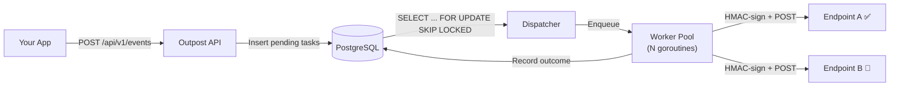

# Outpost

Multi-tenant webhook delivery engine built with Go and PostgreSQL.

Outpost accepts webhook events from your application, queues them in PostgreSQL, and delivers them to customer endpoints with HMAC-SHA256 signatures, exponential backoff, per-endpoint rate limiting, circuit breakers, and dead-letter queues.

[](https://golang.org)
[](https://www.postgresql.org/)
[](LICENSE)
[](http://localhost:8080/docs)

---

## About

Outpost handles the full lifecycle of outbound webhooks. Your app publishes an event, Outpost fans it out to every subscribed endpoint, signs each payload, delivers it, and deals with failures along the way: retries with backoff, per-endpoint rate limiting, dead-letter queues, circuit breakers.

Where it goes further is recovery. When an endpoint crosses the failure threshold and gets disabled, Outpost doesn't just leave it there. It periodically probes the endpoint and re-enables it automatically once it starts responding again. No one has to remember to go flip it back on.

The entire system runs on Go and PostgreSQL. No Redis, no Kafka, no external message broker. PostgreSQL handles both storage and job queuing via `SKIP LOCKED`.

---

## Architecture



### How Delivery Works

1. **Event ingestion.** Your app sends a `POST /api/v1/events` with a JSON payload and event type. Outpost looks up every endpoint subscribed to that event type and inserts one `delivery_attempt` row per endpoint in a single transaction.

2. **Polling dispatcher.** A background goroutine ticks on a configurable interval (default 2s) and runs a single SQL statement that atomically claims a batch of pending attempts using `SELECT ... FOR UPDATE SKIP LOCKED`. Rows are locked at the database level, so multiple Outpost instances can poll the same table without claiming the same task.

   The dispatcher also implements adaptive drain: if a full batch is returned, it immediately queries again without waiting for the next tick. Low throughput polls lazily, high throughput drains aggressively.

3. **Worker pool.** Claimed tasks are pushed into a bounded buffered channel. A fixed pool of goroutines pulls tasks, acquires a rate limiter token (if configured), signs the payload with HMAC-SHA256, sends the HTTP POST, and records the outcome back to PostgreSQL.

   If the channel is full (backpressure), the dispatcher reverts unclaimed tasks to `pending` in the database. Nothing is lost.

4. **Outcome recording.** After each delivery, the recorder:
   - Checks if the error is retryable (5xx, 429, network errors = yes; 4xx = no)
   - Schedules the next retry with exponential backoff and jitter
   - Moves exhausted attempts to the dead-letter queue
   - Updates the endpoint's failure counter and trips the circuit breaker if the threshold is crossed

---

## Concurrency Model

| Component | Mechanism | Why |
|---|---|---|
| Dispatcher lifecycle | `sync.Once` for start/stop, `chan struct{}` for signaling | Prevents double-start, ensures clean stop propagation |
| Worker pool | Fixed goroutines + bounded `chan DeliveryTask` | Predictable memory footprint, no unbounded goroutine spawning |
| Rate limiter registry | `sync.Map` with `LoadOrStore` | Lock-free reads on the hot path, one limiter instance per endpoint under concurrent access |
| Shutdown ordering | HTTP > Dispatcher > Workers > DB pool | Reverse dependency order so no new work enters the pipeline |
| Panic recovery | `recover()` boundary per worker | A panicking delivery doesn't kill the goroutine, it logs and continues |

Graceful shutdown pipeline in `main.go`:
1. Stop accepting HTTP requests (5s timeout for in-flight requests)
2. Stop the dispatcher (no more tasks claimed from the database)
3. Close the task channel, drain remaining workers (15s timeout)
4. Close the database connection pool

---

## Retry Strategy

Failed deliveries follow a stepped exponential backoff schedule with ±20% uniform jitter:

| Attempt | Base Delay | With Jitter |
|---|---|---|
| 1st failure | 30s | 24s to 36s |
| 2nd failure | 2 min | 1m36s to 2m24s |
| 3rd failure | 10 min | 8m to 12m |
| 4th failure | 1 hour | 48m to 1h12m |
| 5th failure | 4 hours | 3h12m to 4h (capped) |

After 5 failures (configurable), the attempt moves to the dead-letter queue and can be replayed through the API.

The jitter prevents thundering herd problems when a downstream endpoint recovers.

**Retryable:** 5xx server errors, 429 rate limited, network timeouts, DNS failures.
**Not retryable:** 4xx client errors (400, 401, 403, 404, 422). The request itself is wrong, retrying won't help.

---

## Security

Every outbound webhook is signed using HMAC-SHA256 with a per-endpoint secret. The signature is sent as `X-Outpost-Signature: sha256=<hex>`.

**Headers sent with every webhook:**

| Header | Example |
|---|---|
| `X-Outpost-Signature` | `sha256=d3b07384d113edec49eaa6...` |
| `X-Outpost-Event` | `invoice.paid` |
| `X-Outpost-Event-ID` | `b9f5f0b4-3c1d-4e9b-b0b2-7a5f6e8c9d0a` |
| `X-Outpost-Timestamp` | `1726425937` |
| `User-Agent` | `Outpost-Webhook-Engine/1.0` |

### Verifying Signatures

```go
// Go
func VerifyWebhook(payload []byte, secret, signature string) bool {
    sig := strings.TrimPrefix(signature, "sha256=")
    mac := hmac.New(sha256.New, []byte(secret))
    mac.Write(payload)
    expected := hex.EncodeToString(mac.Sum(nil))
    return hmac.Equal([]byte(sig), []byte(expected))
}
```

```python
# Python
import hmac, hashlib

def verify_webhook(payload: bytes, secret: str, signature: str) -> bool:
    sig = signature.removeprefix("sha256=")
    expected = hmac.new(secret.encode(), payload, hashlib.sha256).hexdigest()
    return hmac.compare_digest(sig, expected)
```

Both use constant-time comparison to prevent timing side-channel attacks.

---

## API

Interactive Swagger docs at [localhost:8080/docs](http://localhost:8080/docs).

| Method | Endpoint | Description |
|---|---|---|
| `POST` | `/api/v1/applications` | Register a tenant (returns API key) |
| `GET` | `/api/v1/applications` | List applications |
| `POST` | `/api/v1/event-types` | Create an event type |
| `GET` | `/api/v1/event-types` | List event types |
| `POST` | `/api/v1/endpoints` | Register a destination URL |
| `GET` | `/api/v1/endpoints` | List endpoints |
| `PATCH` | `/api/v1/endpoints/:id` | Update endpoint |
| `DELETE` | `/api/v1/endpoints/:id` | Remove endpoint |
| `POST` | `/api/v1/endpoints/:id/subscriptions` | Subscribe endpoint to event type |
| `DELETE` | `/api/v1/endpoints/:eid/subscriptions/:sid` | Unsubscribe |
| `POST` | `/api/v1/events` | Publish event (triggers fan-out) |
| `GET` | `/api/v1/events/:id/deliveries` | Delivery attempts for an event |
| `POST` | `/api/v1/deliveries/:id/retry` | Retry a failed delivery |
| `POST` | `/api/v1/events/:id/replay` | Replay all failed deliveries |
| `GET` | `/api/v1/stats/summary` | Delivery statistics |
| `GET` | `/health` | Database connectivity check |

### Quick Example

```bash
# Register a tenant
curl -s -X POST http://localhost:8080/api/v1/applications \
  -H "Content-Type: application/json" \
  -d '{"name": "My App"}' | jq .

# Create an event type
curl -s -X POST http://localhost:8080/api/v1/event-types \
  -H "Authorization: Bearer $API_KEY" \
  -H "Content-Type: application/json" \
  -d '{"name": "order.completed", "description": "Order fulfilled"}'

# Register an endpoint
curl -s -X POST http://localhost:8080/api/v1/endpoints \
  -H "Authorization: Bearer $API_KEY" \
  -H "Content-Type: application/json" \
  -d '{"url": "https://webhook.site/your-uuid", "description": "Partner CRM", "rate_limit": 10}'

# Subscribe endpoint to event type
curl -s -X POST http://localhost:8080/api/v1/endpoints/$ENDPOINT_ID/subscriptions \
  -H "Authorization: Bearer $API_KEY" \
  -H "Content-Type: application/json" \
  -d '{"event_type_id": "'$EVENT_TYPE_ID'"}'

# Publish an event
curl -s -X POST http://localhost:8080/api/v1/events \
  -H "Authorization: Bearer $API_KEY" \
  -H "Content-Type: application/json" \
  -d '{
    "event_type": "order.completed",
    "idempotency_key": "order_12345",
    "payload": {"order_id": "order_12345", "total": 149.99}
  }'
# 202 Accepted. Delivery tasks are queued and processing.
```

---

## Project Structure

```
outpost/
├── cmd/api/main.go              # Entrypoint, dependency wiring, graceful shutdown
├── internal/
│   ├── config/                  # Env-based configuration with validation
│   ├── database/                # pgxpool connection factory
│   ├── dto/                     # Request/response data transfer objects
│   ├── engine/                  # Core delivery engine
│   │   ├── deliverer.go         # HTTP POST with timeout and body caps
│   │   ├── dispatcher.go        # Background poller with adaptive drain
│   │   ├── worker_pool.go       # Bounded goroutine pool with backpressure
│   │   ├── recorder.go          # Outcome recording and circuit breaker updates
│   │   ├── retry.go             # Stepped backoff with jitter
│   │   ├── limiter.go           # Per-endpoint token bucket rate limiter
│   │   └── signer.go            # HMAC-SHA256 signing and verification
│   ├── handler/                 # HTTP handlers (Gin)
│   ├── middleware/              # Auth, CORS, logging, panic recovery
│   ├── models/                  # Domain types
│   ├── repository/              # PostgreSQL data access layer
│   ├── response/                # Standardized JSON response helpers
│   ├── router/                  # Route registration and middleware wiring
│   ├── server/                  # HTTP server lifecycle
│   └── service/                 # Business logic layer
├── migrations/                  # 8 sequential SQL migrations (up + down)
├── tests/integration/           # End-to-end tests against real PostgreSQL
├── docs/                        # Auto-generated OpenAPI spec
├── Dockerfile                   # Multi-stage build (golang:alpine > alpine:3.20)
├── docker-compose.yml           # One-command local setup
└── Makefile                     # Build, test, lint, migrate, swagger targets
```

---

## Running Locally

```bash
# Start PostgreSQL and Outpost
docker compose up -d

# Verify
curl http://localhost:8080/health
# {"status":"healthy","service":"outpost","database":"connected"}

# Or run outside Docker
cp .env.example .env
make migrate-up
make run
```

---

## Configuration

All settings via environment variables:

| Variable | Default | Description |
|---|---|---|
| `SERVER_PORT` | `8080` | HTTP listen port |
| `GIN_MODE` | `debug` | `debug` or `release` |
| `DB_HOST` | `localhost` | PostgreSQL host |
| `DB_PORT` | `5433` | PostgreSQL port |
| `DB_USER` | `postgres` | Database user |
| `DB_PASSWORD` | `postgres` | Database password |
| `DB_NAME` | `outpost` | Database name |
| `DB_SSL_MODE` | `disable` | `disable` or `require` |
| `WORKER_COUNT` | `5` | Delivery worker goroutines |
| `QUEUE_SIZE` | `100` | Buffered channel capacity |
| `DISPATCHER_POLL_INTERVAL` | `2s` | Polling interval for pending tasks |
| `DISPATCHER_BATCH_SIZE` | `50` | Tasks claimed per poll cycle |
| `MAX_RETRIES` | `5` | Attempts before dead-lettering |
| `RETRY_BASE_DELAY` | `30s` | First retry delay |
| `RETRY_MAX_DELAY` | `4h` | Backoff ceiling |
| `CIRCUIT_BREAKER_MAX_FAILURES` | `20` | Consecutive failures to auto-disable endpoint |

---

## Testing

~6,000 lines of production code, ~6,000 lines of test code across 29 test files.

```bash
make test              # Unit tests
make test-integration  # End-to-end against real PostgreSQL
make test-coverage     # Coverage report with HTML output
make lint              # golangci-lint, zero warnings
```

Unit tests use hand-written interface mocks (no codegen) for the repository and service layers.

Integration tests run against a real PostgreSQL instance and cover the full lifecycle: event ingestion, fan-out, delivery attempt creation, idempotency enforcement, and retry state transitions.

---

## Database

8 migrations applied in order:

1. **applications** - Tenant accounts with auto-generated `op_live_...` API keys
2. **endpoints** - Webhook destination URLs with unique signing secrets (`whsec_...`)
3. **event_types** - Named event categories (e.g. `invoice.paid`)
4. **subscriptions** - Many-to-many link between endpoints and event types
5. **events** - Ingested payloads with idempotency keys
6. **delivery_attempts** - The queue. Status lifecycle: `pending > processing > delivered | failed | dead_letter`
7. **rate_limit** - Per-endpoint RPS configuration
8. **health_tracking** - Consecutive failure counter for circuit breaker logic

The `delivery_attempts` table doubles as a job queue using `FOR UPDATE SKIP LOCKED`, which lets PostgreSQL handle locking semantics instead of requiring a separate message broker.

---

## Design Decisions

**PostgreSQL as the queue.** `SKIP LOCKED` eliminates an entire infrastructure dependency (no Redis, RabbitMQ, or Kafka needed) while providing exactly-once claim semantics within a single transaction. The tradeoff is throughput ceiling, but for webhook delivery volumes (hundreds to low thousands per second), it's more than sufficient and operationally much simpler.

**Stepped multipliers over pure exponential.** Instead of `baseDelay * 2^attempt`, the retry schedule uses hand-tuned multipliers (1x, 4x, 20x, 120x, 480x). This gives a more practical progression from 30 seconds to 4 hours that aligns with real-world endpoint recovery patterns.

**Token bucket rate limiting.** `golang.org/x/time/rate` implements token bucket, which allows short bursts up to the bucket size while maintaining an average rate. The limiter registry uses `sync.Map` with `LoadOrStore` for zero-allocation reads on the hot path, and dynamically adjusts if a customer updates their endpoint's rate limit via the API.

**Response body capping.** The deliverer reads at most 4 KB of response body via `io.LimitReader`. This prevents memory exhaustion from endpoints that return large HTML error pages.

---

## License

MIT
